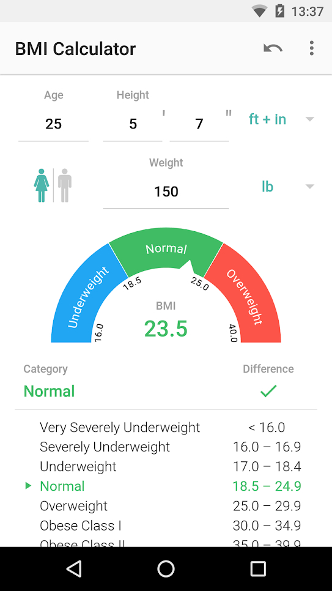
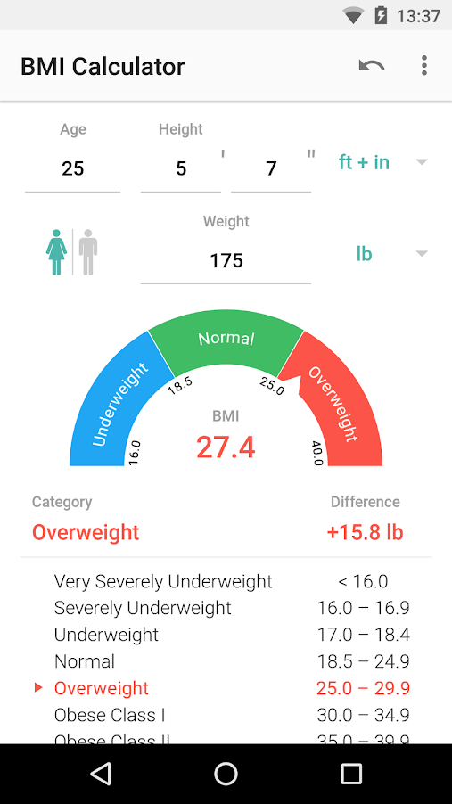
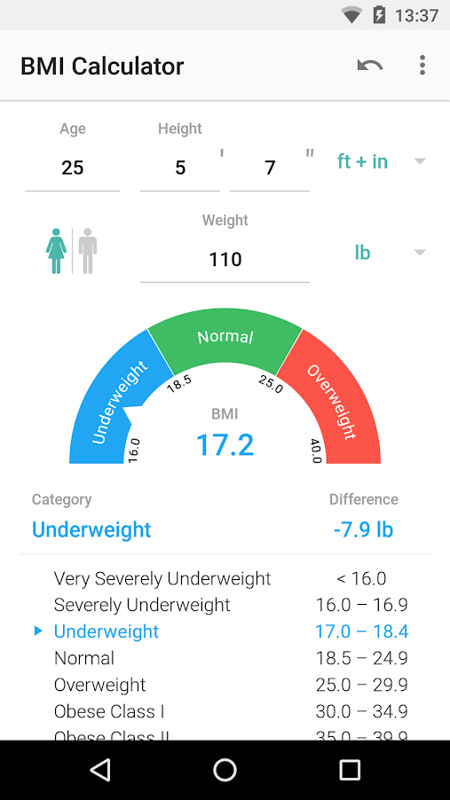

# EP3. Workshop BMI Calculator

Workshop นี้น้องจะต้องทำ WebApp: BMI Calculator ที่เมื่อกรอกข้อมูลน้ำหนัก (kg) ส่วนสูง (cm) และเพศ แล้วโปรแกรมจะแสดงผลว่าเราอยู่ในเกณฑ์ไหน พร้อมแสดงแถบสีของแต่ละระดับ

สิ่งที่จะได้ใช้ในการทำ WebApp นี้

* HTML
  * div สำหรับแยกแต่ละ component
  * h1, h2, p, span สำหรับข้อความ
  * form, text input, radio input สำหรับกรอกข้อมูล
  * button สำหรับกดส่งข้อมูล
  * table สำหรับแสดงข้อมูล BMI แต่ละช่วง
* CSS
  * color
  * background-color
* JavaScript
  * function สำหรับคำนวนค่า BMI
  * if/else สำหรับคำนวนเกรด

## Acceptance Criteria

* มี input field ให้กรอกน้ำหนัก, ส่วนสูง, เพศ
* มีปุ่มให้กดคำนวนค่า BMI เมื่อกดแล้วจะแสดงค่า BMI พร้อมคำอธิบาย
* มีตารางแสดงค่า BMI ช่วงต่างๆ
* ค่า BMI ที่แสดง จะต้องแยกสีตามความเหมาะสม เช่น ปกติสีเขียว อันตรายสีแดง
* สามารถออกแบบหน้าตาโปรแกรมได้ตามที่ต้องการ หรือใส่คำอธิบายเพิ่มเติมเกี่ยวกับวิธีคำนวน
* เอาโค้ดขึ้น Github

  

## ตัวอย่าง

* [https://www.calculator.net/bmi-calculator.html?ctype=metric\&cage=12\&csex=f\&cheightfeet=5\&cheightinch=10\&cpound=160\&cheightmeter=180\&ckg=65\&printit=0\&x=70\&y=32](https://www.calculator.net/bmi-calculator.html?ctype=metric\&cage=12\&csex=f\&cheightfeet=5\&cheightinch=10\&cpound=160\&cheightmeter=180\&ckg=65\&printit=0\&x=70\&y=32)
* [https://www.hdfclife.com/financial-tools-calculators/bmi-calculator](https://www.hdfclife.com/financial-tools-calculators/bmi-calculator)
* [https://play.google.com/store/apps/details?id=com.appovo.bmicalculator\&hl=en\_US\&gl=US](https://play.google.com/store/apps/details?id=com.appovo.bmicalculator\&hl=en\_US\&gl=US)
* [https://play.google.com/store/apps/details?id=com.codium.bmicalculator\&hl=en\_US\&gl=US](https://play.google.com/store/apps/details?id=com.codium.bmicalculator\&hl=en\_US\&gl=US)
